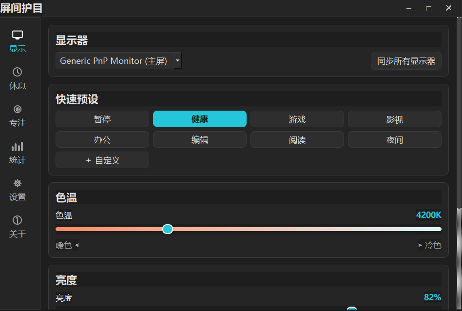
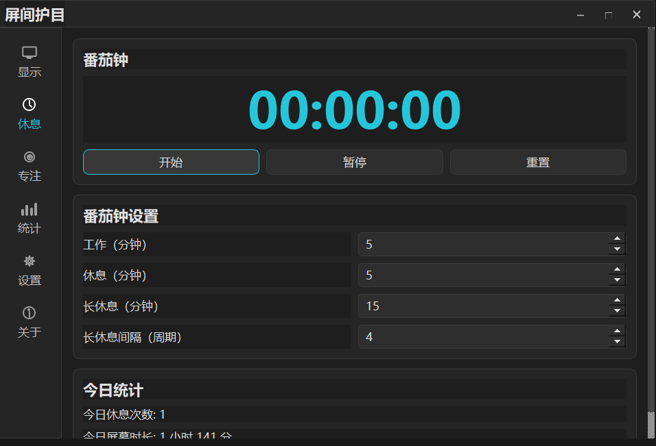
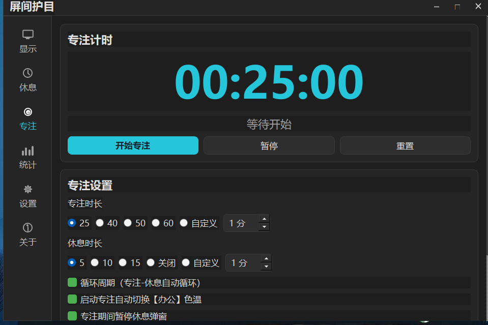
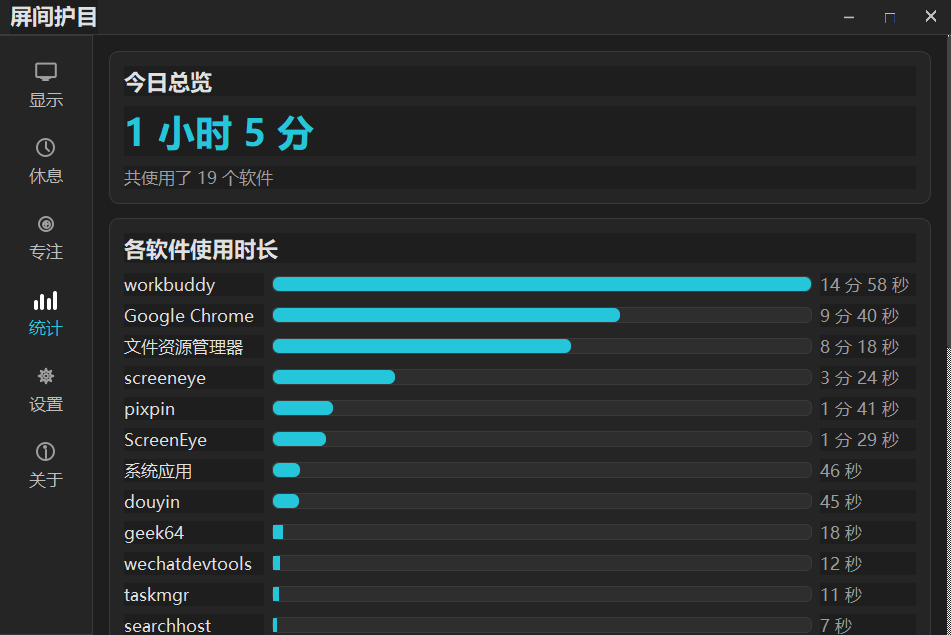

# 屏间护目 ScreenEye

一款轻量级 Windows 桌面护眼工具，通过调节屏幕色温与亮度，帮助你在长时间使用电脑时减轻眼部疲劳。

> 支持 Windows 10 (1903+) / 11（x64）

---

## 下载安装

> 当前版本：**v1.0.0**

- 进入右侧 [Releases](../../releases) 页面，下载最新版 `ScreenEye_Setup.exe`。
- 双击安装包，按向导提示完成安装即可开始使用。
- 安装过程无需管理员权限，默认安装到当前用户的应用目录。

---

## 它能做什么

| 功能 | 说明 |
|------|------|
| **色温调节** | 1900K ~ 10000K 无级调节，从暖黄到冷白，夜间使用更柔和。 |
| **亮度调节** | 20% ~ 100% 微调，配合色温进一步降低屏幕刺眼感。 |
| **快速预设** | 8 种内置模式一键切换：健康、游戏、影视、办公、编辑、阅读、夜间、暂停。 |
| **多显示器支持** | 自动识别所有显示器，每台可独立设置色温与亮度，支持一键同步。 |
| **番茄钟休息** | 工作/休息倒计时，到点弹出全屏休息提醒，帮助你劳逸结合。 |
| **专注计时** | 25 分钟专注倒计时，可自动切换办公色温、暂停休息弹窗。 |
| **屏幕使用统计** | 记录今日屏幕使用时长，并按软件展示使用排行。 |
| **开机自启** | 可选随 Windows 自动启动，无需每次手动打开。 |
| **全局快捷键** | 暂停、切换预设、调节色温、开始专注等操作都可通过快捷键完成。 |
| **主题切换** | 支持暗黑 / 浅色 / 跟随系统三种外观。 |
| **系统托盘** | 常驻托盘，右键即可快速切换预设、开始专注或退出。 |

---

## 界面预览

### 显示设置
快速切换预设、调节色温与亮度，多显示器独立控制。

### 番茄钟休息
工作/休息计时与今日休息统计，提醒你定时放松双眼。

### 专注计时
倒计时专注，可选自动切换办公色温、暂停休息弹窗。

### 使用统计
查看今日屏幕使用总时长，以及各软件的使用排行。

---

## 隐私说明

**屏间护目不会收集、上传或共享你的任何个人数据。**

- 所有配置与使用记录均保存在本地（`%APPDATA%\CareUEyes`）。
- 软件运行过程中**不连接网络**，无账号、无云端、无遥测。
- 屏幕使用统计仅读取本地前台窗口信息，用于本地展示，不会离开你的电脑。

---

## 开源协议

MIT License
